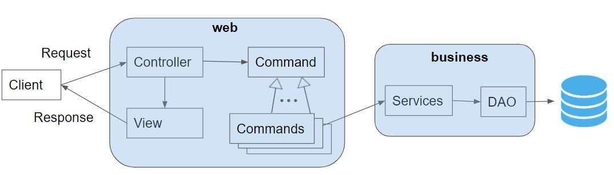

# BMI Proof Of Concept project

This is a proof of concept implementation of a previous project made by Jon Bertelsen
It is built on top of this [suggestion for a future starter-seed](https://github.com/Lars-m/sem2-startcode) meant for 2. semester at CPHBusiness.dk - DAT
It's meant as a proof of concept for what can be done with this start code

## Getting Started

Setup the required database using the script dbInit.sql, found in `src/main/java/business/dao`

Add the required connection details for your database in Connector.js (same path as above)

## What it does

- Demonstrates the use of both `user` and `admin` roles in the system, and different ways to use
the FrontController and Commands
- Demonstrates "lazy load" of a one-to-many relation in the  BmiEntry
- And a lot of other smaller "things" you will encounter in a project like this

## Architecture
This is the overall (slightly simplified) architecture used in this project

